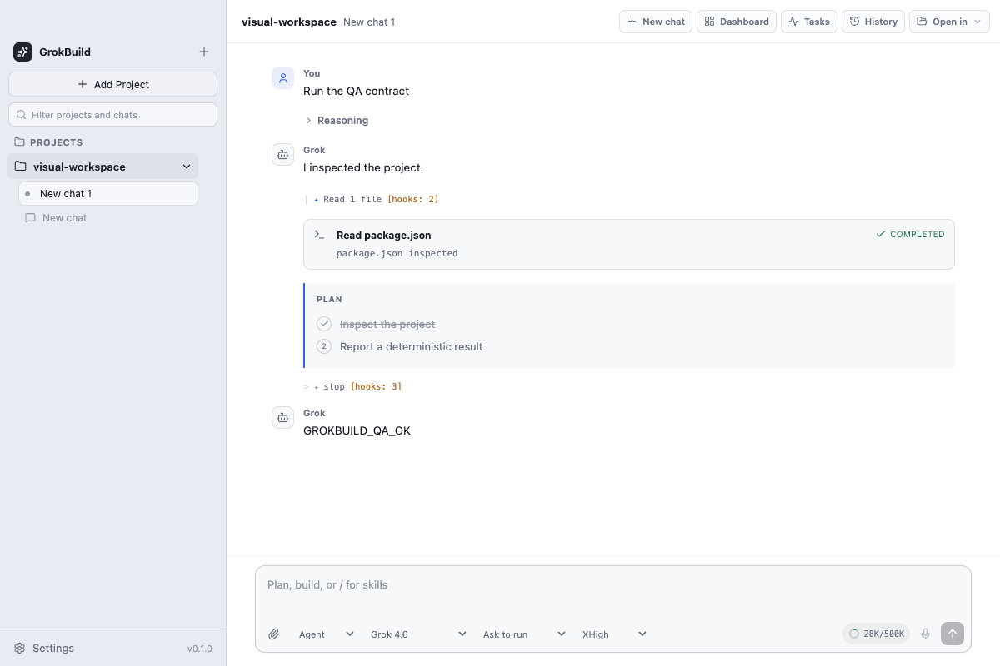

# GrokBuild Electron

> A native-feeling macOS desktop client for the Grok CLI (xAI), rebuilt with Electron, React, and TypeScript — with a deterministic ACP replay QA harness that keeps it honest against the original Swift app.

[](LICENSE)
[-black?logo=apple)](#requirements)
[](electron.vite.config.ts)
[](qa/contracts/README.md)



GrokBuild Electron is a Vite, React, TypeScript, and Electron migration of the community GrokBuild macOS client. It is a desktop client and local state manager; the official `grok agent stdio` process still owns model execution, authentication, tools, skills, hooks, and MCP runtime behavior.

**Highlights**

- **Multi-project, multi-session chat UI** for the official Grok CLI over ACP: streaming text and reasoning, tool cards, plan approval, permission prompts, and Ask User question cards.
- **Parity-driven, not vibes-driven**: the Swift app and a pinned Grok CLI contract are the behavioral reference; every migrated feature carries machine-readable evidence in [`qa/contracts/parity-evidence.json`](qa/contracts/parity-evidence.json).
- **Deterministic QA harness**: an ACP mock/replay server, 89 unit test files, Playwright Electron E2E, and pixel visual baselines — no live model turns needed to gate a PR.
- **Security-first process model**: sandboxed renderer, typed `contextBridge` allowlist IPC, no Node in the renderer, one validated `utilityProcess` per session owning the Grok child process.

This repository is an active parity milestone, not a replacement-ready release. The machine-readable parity manifest and release gate intentionally report remaining P0/P1 work. Read [Migration status](docs/MIGRATION_STATUS.md) before using the app for important work.

## What works today

- Sandboxed React renderer behind a fixed, typed preload bridge.
- Projects, local sessions, pins, duplicate/close/remove, persisted selection, lazy ACP resume, stale-session fallback, and explicit retry.
- Swift-priority sidebar status, transient background-completion unread state, local project/title search, and mutually exclusive pinned/settled shelves persisted in schema v5.
- A current-project, six-group Sessions Dashboard with a bounded main-owned Git projection, plus a separate Grok CLI History browser whose renderer sees only opaque capabilities; opening resumes through ACP and deletion uses native confirmation.
- One validated Electron `utilityProcess` per connected session; that worker alone owns the ACP parser and Grok child process.
- Streaming text, thought, tool, plan, context, turn-usage, mode, and bounded hook/activity projections.
- A read-only, CLI-owned Tasks & Workflows view for scheduled work, observed background commands/monitors/subagents, workflow phases and agent-call budgets, and the current session goal/token budget. Typed CLI notifications are primary; the pinned Swift scheduler tool shapes are a bounded compatibility fallback.
- Bounded ACP terminal and filesystem reverse hosts.
- FIFO tool permissions plus Auto accept, kept separate from Plan approval and Ask User questions.
- Plan verdicts and single/multi-select question cards, including Other/free-form answers, cancellation, reconnect, and remote resolution.
- A separate, versioned local Saved Agent roster with explicit recovery, an idempotent five-agent starter crew, per-chat binding, strict inline ACP profiles, and reconnect-on-profile-change behavior. Settings, sidebar search/badges, and the composer use this local identity; the project-scoped Grok CLI agent catalog is displayed read-only and is not treated as the same entity.
- A main-owned, capability-based browser for Grok CLI global/workspace/session Markdown memory, with bounded previews, global remember notes, session-only native-confirmed deletion, Privacy Mode containment, and a persisted launch policy that sends exactly one of `--experimental-memory` or `--no-memory` to every new or resumed worker.
- File/image attachment chips backed by opaque, session-bound, consume-once main-process leases. Paths and image bytes do not enter renderer snapshots or persisted app state.
- CLI-owned MCP list/add/remove/enable/disable and explicit Doctor checks with redacted results.
- Read-only Grok Doctor checks for CLI, version, cached sign-in presence, and config presence, plus an explicit session Retry action.
- Explicit Swift plist preview, non-destructive merge, commit, and cancel. The renderer receives counts and an opaque token, not imported transcript content or source paths.
- App/CLI update discovery and a cached release-page action. The packaged-App path keeps its one-shot candidate in main, asks for native confirmation, stages by digest and size, revalidates current/candidate signing identity, pauses idle ACP work, and delegates replacement/restart to Electron's Squirrel.Mac updater. The zero-argument CLI path shares those gates, canonicalizes strict semantic versions including prereleases, confirms the exact target, runs only `grok update --version <target>`, and requires the local `grok --version` to equal that target before ACP may reconnect. Its feed refresh is display-only; an uncertain on-disk result instead retains the gates and takes a guarded quit path.
- macOS close-to-hide, Dock/second-instance restore, basic status item, Settings shortcut, content-free notifications, and bounded quit cleanup.

The Tasks & Workflows milestone is observational, not a second task engine. Electron does not create,
pause, resume, stop, or delete these resources, does not mint short-lived action capabilities, and
does not persist the projection or its CLI identities. Scheduled work runs only while GrokBuild is
open and that session's Grok process remains active; quitting the app makes no promise that work
continues.

The App installer is deliberately unavailable to development, unsigned, renamed, or non-Applications builds. Neither App nor CLI installation runs automatically. The CLI installer is available only after a fresh actionable check and native confirmation; main chooses the configured CLI and selected project working directory. Local builds intentionally have no App feed; the signed release workflow derives the production feed from its GitHub repository and seals it into the packaged App. This machine still has no Developer ID identity, real published release, or signed previous-version-to-current App installation evidence, so the update rows remain partial.

## Requirements

- macOS 26 or later on Apple Silicon
- Node.js 24
- Grok CLI installed, normally at `~/.grok/bin/grok`
- `grok login` completed for real-CLI use

## Run locally

```bash
npm ci
npm run reference:fetch
npm run dev
```

The deterministic QA lane uses the pinned Swift reference plus a request-driven fake CLI; it does not require a Grok account or model quota:

```bash
npm run qa
```

Useful focused commands:

```bash
npm run typecheck
npm test
npm run test:e2e
npm run test:visual
npm run qa:contracts
npm run qa:report
```

`npm run qa:release-readiness` is deliberately separate from ordinary development QA. It fails while any required parity row is incomplete or any relevant known difference is still pending. The signed release workflow runs it before packaging.

## Package and smoke boundaries

Build and inspect a local preview artifact with:

```bash
npm run package:mac
npm run verify:package
npm run smoke:package
```

The package verifier reads Electron fuses from the binary, checks ASAR integrity metadata and required resources, validates minimized Info.plist capabilities, and inspects the DMG. In the signed release lane it also hashes the exact `.app.zip` entry from `SHA256SUMS`, validates its archive shape, extracts it, and repeats signature/designated-requirement/Team/version/build/architecture/Gatekeeper/stapler checks on that extracted upload candidate. A local preview package skips this signed-only branch and is not evidence of a signed/notarized release, a successful old-to-new installed-App replacement, or recovery on a real release host.

Release smoke and signing are deliberately split. A separate unsigned job receives no release secrets and launches its candidate with exactly 11 allowlisted environment keys, including isolated HOME/TMPDIR; the signing job never launches the candidate. Both checkouts disable persisted credentials. After signing/notarization, an unconditional cleanup removes the P8 file, deletes keychains inside a dedicated `APP_BUILDER_TMP_DIR`, removes that directory, and asserts both locations are gone before the update ZIP is created.

The extracted exact-ZIP verification is the final repository-produced executable trust step. After it succeeds, the workflow only rechecks `SHA256SUMS` and uploads those unchanged files; it runs no repository script, candidate binary, or artifact transformation afterward.

Probe the installed official CLI without spending a model turn:

```bash
npm run smoke:real-cli
```

An opt-in release lane may set `GROKBUILD_REAL_TURN=1`; that uses the signed-in account and is never a deterministic PR gate.

## QA truth model

- Swift `v0.3.2` at the commit pinned in `reference/upstream.json` is the desktop behavior and visual reference.
- The pinned Grok CLI contract is authoritative for ACP wire behavior.
- `docs/PARITY_MATRIX.md` is the human inventory; `qa/contracts/parity-evidence.json` is the machine status/evidence source.
- `qa/contracts/known-differences.json` records scoped pending or approved differences. Pending differences block release readiness; they are not waivers.
- Ten canonical macOS visual baselines cover the conversation, context-usage popover, Sessions Dashboard, distinct Sessions History surface, Tasks & Workflows projection, Saved Agents settings, light/dark Privacy Mode, and normal/private Memory settings.
- The opt-in [Swift black-box AX driver](docs/SWIFT_BLACK_BOX_QA.md) runs the native reference in an isolated profile. Missing Accessibility or Screen Recording authorization is reported as blocked, never green.
- `npm run qa:compare -- --expected … --actual …` performs a bounded, value-redacting canonical JSON diff. Ignored subtrees require an approved, unexpired registry entry.

See [QA contracts](qa/contracts/README.md), the [parity matrix](docs/PARITY_MATRIX.md), [architecture](docs/ARCHITECTURE.md), and [security model](docs/SECURITY.md).

## Independence and attribution

This project is independent and is not endorsed by xAI. The behavior reference and adapted icon are derived from [`rimusz/grok-build-desktop`](https://github.com/rimusz/grok-build-desktop), licensed under Apache-2.0. Grok and xAI names remain the property of their respective owners.
